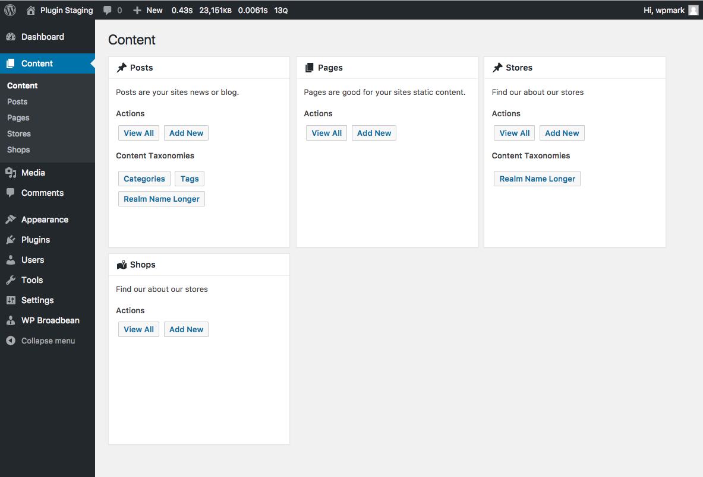
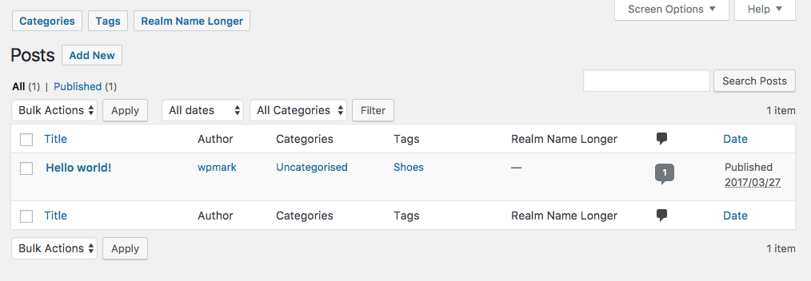

# Better Admin Post Types

If you have a WordPress site with lots of custom post types installed then the admin menu can get pretty congested. Add to that plugins which add their own top level admin menus and the admin area can become a little busy to say the least.

This plugin provides a simple solution as it combines all of the post types on your site under one top level menu item called "Content".

On the post listing screen the taxonomies for the current post type are listed at the top of the screen.

Any post type which is registered with the argument of `show_ui => true` will by default be included in the new content block menu item. If a post type declares `show_in_menu` argument to anything other than true it will not be included in the content blocks. This is because it is likely it would be shown elsehwere in the admin menu structure anyway.
